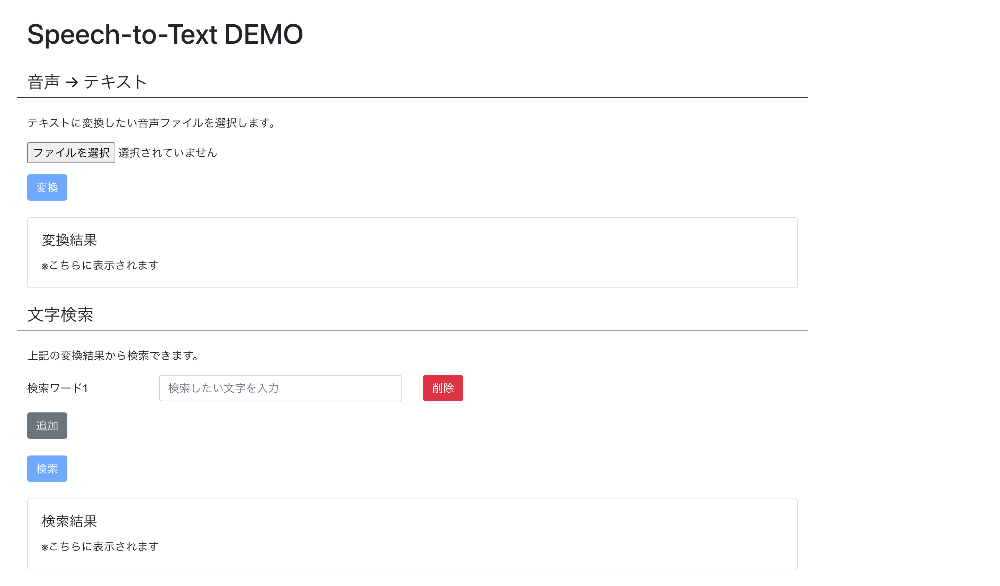
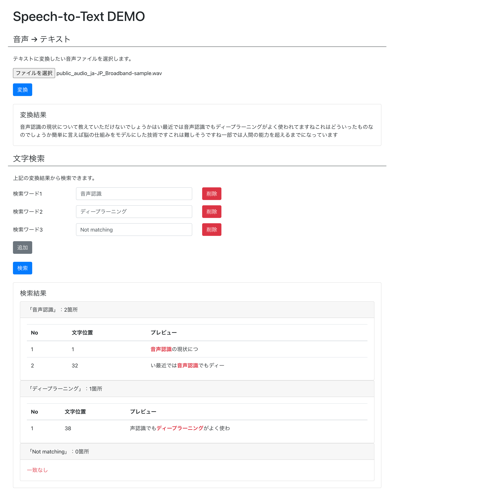
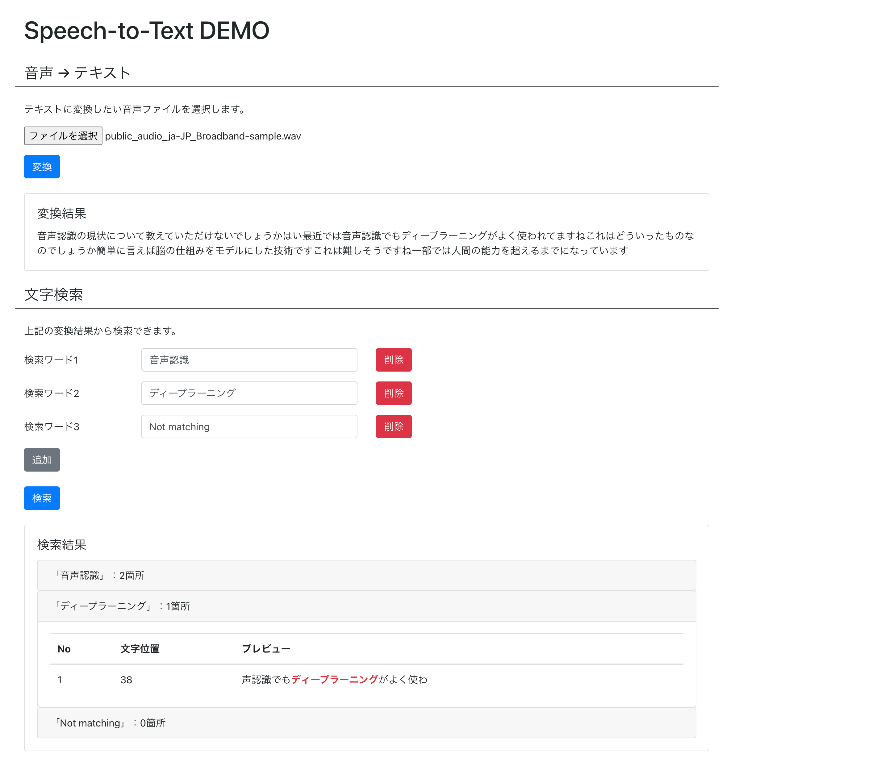

# Speech-to-Text Demo Frontend

音声認識 DEMO のフロントエンドソース

## Author

YU-TA-9

## Image





## Main Libraries

- React 17.0.2
- BootStrap4

## Require

- yarn 1.21.1

## Installation

```zsh
$ yarn

# フロント起動
$ yarn start

# モックサーバ起動 + フロント起動
$ yarn mock
```

## Note

- モックについて
  - json-server を使用
  - 関連ファイルは`/mock`内に格納
